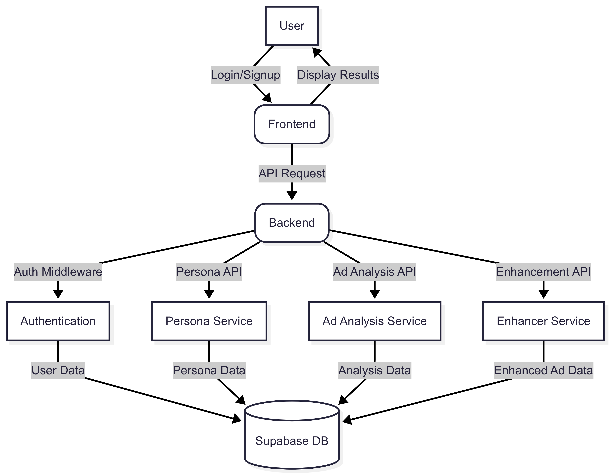

# Epsilon Project

A comprehensive ad analysis and enhancement platform with persona management capabilities.

## Project Overview

This application provides tools for analyzing and enhancing advertisements while considering target personas. It features a React/TypeScript frontend and a Node.js backend, offering functionalities like ad analysis, persona management, and ad enhancement.

## Flow Diagram



## Architecture

### Frontend (src/)
- Built with React + TypeScript + Vite
- Tailwind CSS for UI styling
- Zustand for state management
- Modular components for ad input, persona management, results display, and authentication
- Custom hooks for backend communication and state initialization
- Routing and protected routes for secure navigation

### Backend (backend/)
- Node.js server using Express
- Middleware for authentication (JWT-based) and request validation
- Services for:
  - Ad analysis (text/video)
  - Ad enhancement (AI-powered)
  - Persona management
- Supabase integration for user, persona, and analysis data
- File upload handling for video ads

## Key Features

1. **Authentication System**
   - User signup/login via secure endpoints
   - JWT-based session management
   - Role-based access control (admin/user)
   - Frontend state managed by `authStore` and protected routes

2. **Ad Analysis**
   - Analyze text and video ads for effectiveness
   - Persona-based evaluation: matches ad content to target persona traits
   - Generates performance metrics, improvement suggestions, and detailed reports

3. **Persona Management**
   - Create, update, and delete personas
   - Store demographic, psychographic, and behavioral data
   - Use personas to filter and enhance ad analysis

4. **Ad Enhancement**
   - AI/ML-powered suggestions for improving ad content
   - Text and video enhancement endpoints
   - Aligns ad content with selected persona profiles

## API Routes

### Authentication
- `POST /auth/signup` - Register a new user. Requires email, password, and optional role.
- `POST /auth/login` - Authenticate user and return JWT token.
- `GET /auth/status` - Validate JWT and return user info.

### Personas
- `GET /personas` - Retrieve all personas for the authenticated user.
- `POST /personas` - Create a new persona. Requires persona details (name, traits, etc).
- `PUT /personas/:id` - Update an existing persona by ID.
- `DELETE /personas/:id` - Remove a persona by ID.

### Ad Analysis
- `POST /analysis/text` - Submit a text ad for analysis. Requires ad content and persona ID(s).
- `POST /analysis/video` - Submit a video ad for analysis. Requires video file and persona ID(s).
- `GET /analysis/history` - Get all past analyses for the user.
- `GET /analysis/:id` - Get details of a specific analysis (results, suggestions, persona match).

### Ad Enhancement
- `POST /enhance/text` - Get AI-powered suggestions for improving a text ad. Requires ad content and persona ID(s).
- `POST /enhance/video` - Get suggestions for video ad improvement. Requires video file and persona ID(s).

## Core Components

### Frontend Components
- `AdTypeSelector` - Lets users choose between text and video ad workflows.
- `PersonaDisplay` - Shows persona details, insights, and allows selection for analysis.
- `ResultsDisplay` - Presents analysis results, metrics, and enhancement suggestions.
- `TextAdInput` / `VideoUpload` - Input forms for submitting ads.
- `PersonaInput` - Form for creating/editing personas.
- `RoleGuard` / `ProtectedRoute` - Restricts access based on authentication and user role.
- `Sidebar`, `Layout` - Navigation and page structure.

### Backend Services
- `enhancer.js` - Uses AI/ML models to generate ad improvement suggestions.
- `evaluator.js` - Main logic for evaluating ad effectiveness and persona alignment.
- `persona.js` - CRUD operations for persona data.
- `textEvaluator.js` - Specialized analysis for text ads (sentiment, clarity, relevance).
- `videoEvaluator.js` - Specialized analysis for video ads (engagement, clarity, persona fit).
- `supabase.js` - Handles database operations for users, personas, and analyses.

## Working Flow

1. **User Authentication**
   - User signs up or logs in via frontend forms
   - Credentials sent to backend, JWT issued on success
   - JWT stored in frontend, used for all subsequent API requests
   - Protected routes and components restrict access based on authentication and role

2. **Persona Creation & Management**
   - User creates personas with demographic and psychographic details
   - Personas stored in Supabase and retrieved for selection in ad analysis
   - User can edit or delete personas as needed

3. **Ad Submission & Analysis**
   - User selects ad type (text/video) and target persona(s)
   - Ad content submitted to backend via API
   - Backend analyzes ad using evaluator and persona services
   - Results (metrics, suggestions, persona match) returned to frontend and displayed

4. **Ad Enhancement**
   - User requests enhancement for an ad
   - Backend uses enhancer service (AI/ML) to generate suggestions
   - Enhanced ad and suggestions shown to user

5. **Analysis History & Reports**
   - All analyses are stored and can be viewed in history
   - Users can export reports for further review

## Technical Stack

### Frontend
- **React 18+**: UI library for building interactive interfaces
- **TypeScript**: Type safety for scalable development
- **Vite**: Fast build tool and dev server
- **Tailwind CSS**: Utility-first CSS framework
- **Zustand**: State management
- **React Router**: Routing and navigation

### Backend
- **Node.js**: JavaScript runtime
- **Express**: Web server and routing
- **Supabase**: Database and authentication
- **JWT**: Authentication tokens
- **Multer**: File upload handling
- **AI/ML Services**: For ad analysis and enhancement (can be integrated with external APIs)

### Other
- **PostCSS**: CSS processing
- **ESLint**: Linting and code quality
- **Vercel/Netlify**: (Optional) Deployment platforms

## Getting Started

### 1. Install Dependencies
```bash
# Frontend
npm install

# Backend
cd backend
npm install
```

### 2. Environment Setup
- Create `.env` files in both root and backend directories
- Add Supabase credentials, JWT secret, and any AI/ML API keys

### 3. Run Development Servers
```bash
# Frontend
npm run dev

# Backend
cd backend
npm run dev
```
